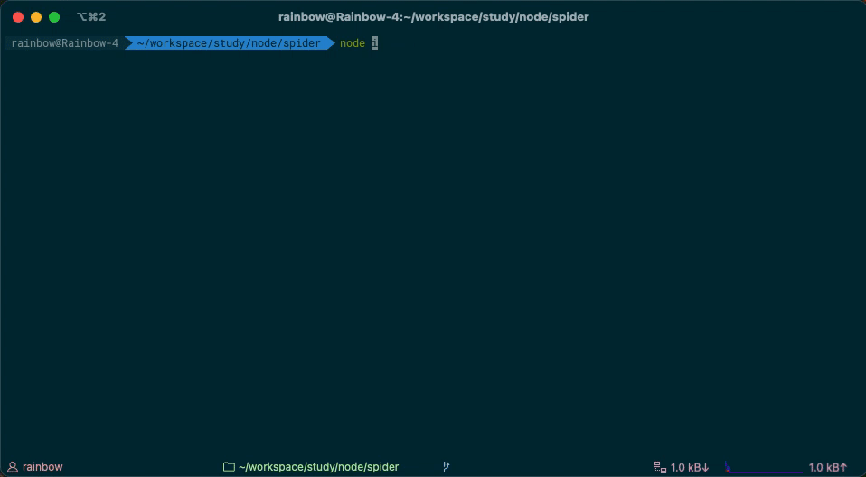

绝大多数的爬虫爬取的是页面的源代码，不能根据浏览器渲染完成DOM结构来爬取。在`SPA应用`中，这样的方式会无法爬取任何数据。如下图：
<div align=center>

<br/>
<font size=2>SPA应用源代码</font>
</div>

## Puppeteer
:::tip
至少需要`Node v6.4.0`， 若要支持`async/await`，则至少`Node v7.6.0`
:::
### 介绍
[`Puppeteer`](https://pptr.dev/)利用`Chromium`创建一个浏览器的环境，等待页面渲染完毕，直接按照DOM结构来爬取数据。当然[`Puppeteer`](https://pptr.dev/)不单单可以用来爬取数据，浏览器中手动执行的绝大多数操作都可以使用[`Puppeteer`](https://pptr.dev/)来完成。例如：

  - 生成页面 PDF。
  - 抓取`SPA（单页应用`并生成预渲染内容（即`SSR（服务器端渲染）`）。
  - 自动提交表单，进行`UI`测试，键盘输入等。
  - 创建一个时时更新的自动化测试环境。 使用最新的`JavaScript`和浏览器功能直接在最新版本的Chrome中执行测试。
  - 捕获网站的[`timeline trace`](https://developers.google.com/web/tools/chrome-devtools/evaluate-performance/reference)，用来帮助分析性能问题。
  - 测试浏览器扩展。

### puppeteer-core
自`1.7.0`版本以来，[`Puppeteer`](https://pptr.dev/)都会发布一个[`puppeteer-core`](https://www.npmjs.com/package/puppeteer-core)包，这个包默认不会下载 Chromium。

[`puppeteer-core`](https://www.npmjs.com/package/puppeteer-core)是一个的轻量级的 Puppeteer 版本，用于启动现有浏览器安装或连接到远程安装。

具体见[puppeteer vs puppeteer-core](https://github.com/GoogleChrome/puppeteer/blob/master/docs/api.md#puppeteer-vs-puppeteer-core).

## 编写程序
### 安装Puppeteer
执行下面的命令，安装`Puppeteer`。
```bash
npm i puppeteer --save
// or
yarn add puppeteer
```
### 编写脚本文件
首先创建一个`Browser`实例，打开页面，然后[`Puppeteer的Api`](https://github.com/GoogleChrome/puppeteer/blob/v1.10.0/docs/api.md#)，进行相关操作
```js
const puppeteer = require('puppeteer');
(async () => {
  // 加载一个浏览器
  const browser = await puppeteer.launch({ headless: true, defaultViewport: null });
  // 相当于创建一个标签页
  const page = await browser.newPage()
  // 打开网址并渲染页面
  await page.goto('http://stcsm.sh.gov.cn/zwgk/kjzc/zcwj/#rightSidebar')

  // 获取爬虫数据
  const spiderData = await getSpiderData()

  //根据页面的DOM结构，编写爬取方法
  async function getSpiderData () {
    const reuslt = await page.evaluate(() => {
      let spiderData = []
      const dataList = document.querySelectorAll('.yjsnews li')
      for (const item of dataList) {
        console.log(item.innerText)
        if(item.innerText) spiderData = [...spiderData, {
          title: item.querySelector('a').innerText,
          time: item.querySelector('.date').innerText,
        }]
      }
      return spiderData
    })
    console.log(chalk.green('数据爬取完毕'))
    return reuslt
  }
})
```
### 执行脚本
运行脚本，爬取数据。
```bash
node index.js
```
运行完毕后，会得到下图的结果：
<div align=center>

<br/>
<font size=2>脚本运行结果</font>
</div>


